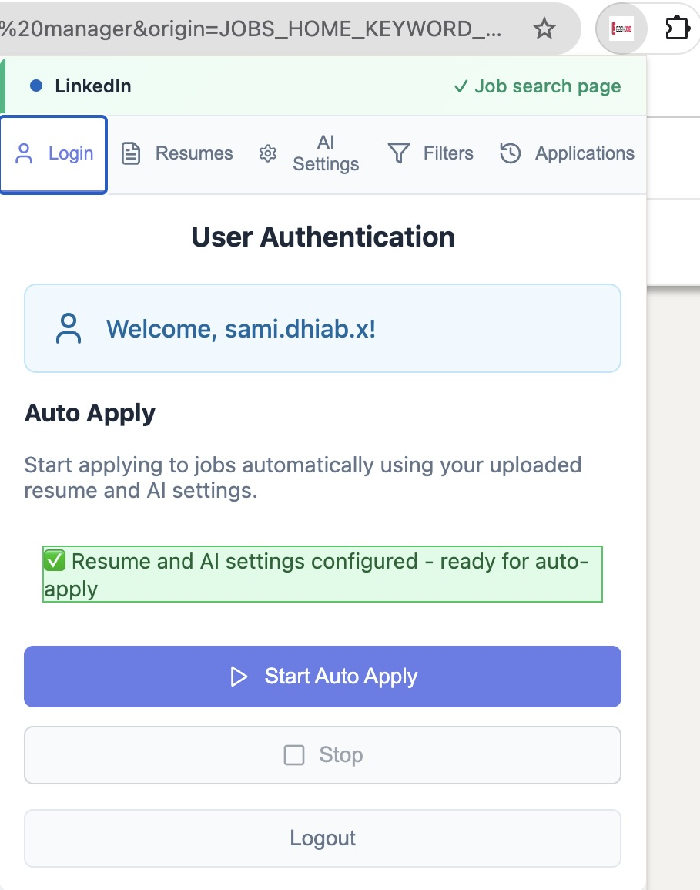
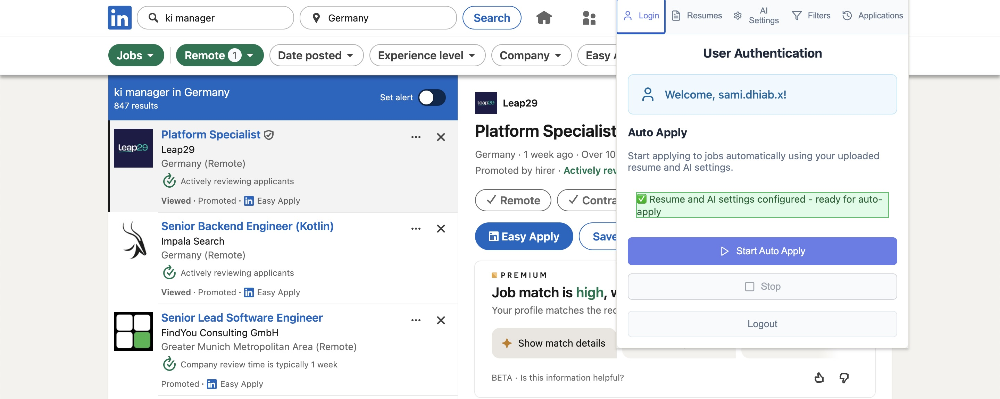
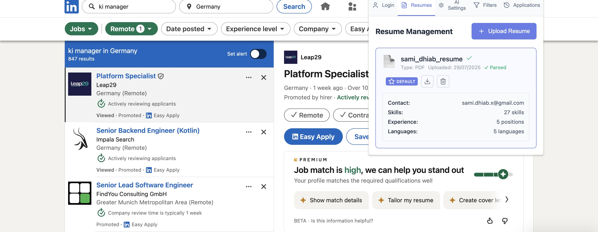
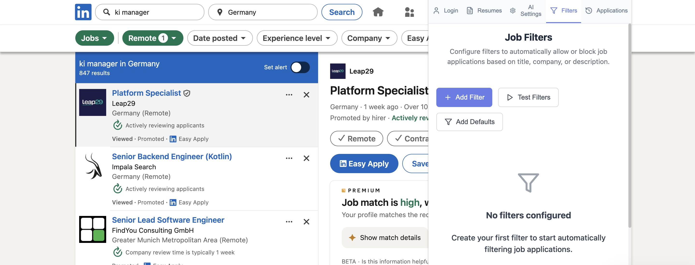
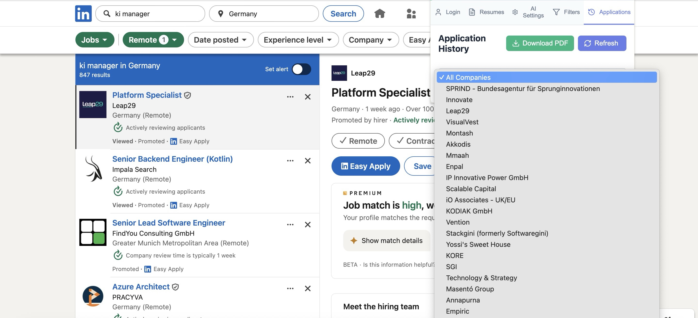

# EasyJob - AI-Powered Job Application Automation

A comprehensive Chrome extension that automates job applications across multiple platforms (LinkedIn, Indeed, Stepstone) using AI-powered responses, intelligent resume management, and advanced job filtering.

## 🚀 Features

- **Multi-Platform Support**: Works with LinkedIn, Indeed, and Stepstone job platforms
- **AI-Powered Automation**: Uses Ollama for generating personalized job application responses
- **Smart Resume Management**: AI-powered resume parsing, analysis, and optimization
- **Advanced Job Filtering**: Intelligent filtering using keywords, location, experience level, and company preferences
- **Application Tracking**: Complete history of all applications with company details and status
- **AI Model Configuration**: Customize AI settings, choose models, and fine-tune response generation
- **Modern React Interface**: Responsive, user-friendly popup dashboard built with React 18
- **Database Backend**: PostgreSQL database with comprehensive data management
- **RESTful API**: Node.js backend for data persistence and AI integration

## 🏗️ Architecture Overview

EasyJob follows a modern, scalable architecture with clear separation of concerns:

```
┌─────────────────┐    ┌─────────────────┐    ┌─────────────────┐
│   Chrome Popup  │    │  Background     │    │   Content       │
│   (React 18)    │◄──►│   Scripts       │◄──►│   Scripts       │
│                 │    │                 │    │                 │
└─────────────────┘    └─────────────────┘    └─────────────────┘
         │                       │                       │
         │                       │                       │
         ▼                       ▼                       ▼
┌─────────────────┐    ┌─────────────────┐    ┌─────────────────┐
│   REST API      │    │   Database      │    │   AI Services   │
│   (Node.js)     │◄──►│  (PostgreSQL)   │◄──►│   (Ollama)      │
└─────────────────┘    └─────────────────┘    └─────────────────┘
```

### Core Components

- **Frontend**: React-based popup interface with modern UI components
- **Background Scripts**: Chrome extension service workers for persistent functionality
- **Content Scripts**: Platform-specific job page integration
- **API Server**: Node.js backend with Express and PostgreSQL
- **AI Engine**: Ollama integration for intelligent response generation
- **Database**: PostgreSQL with comprehensive schema for user data and applications

## 🖥️ User Interface

EasyJob provides an intuitive interface through several key tabs, each designed to streamline your job application process:

### 🚀 Extension Dashboard

*The main extension popup that appears after successful installation, providing quick access to all features.*

### 🔐 Login & Auto Apply

*Start your automated job application journey here. Configure your credentials and begin the auto-apply process with just one click.*

### 📄 Resume Management

*Upload and manage your resume. The AI analyzes your resume to optimize job matching and application responses.*

### ⚙️ AI Settings & Configuration

*Configure AI models, customize response generation, and fine-tune the automation behavior to match your preferences.*

### 🔍 Job Filters

*Set up intelligent job filters using keywords, location preferences, experience requirements, and company criteria to find the perfect opportunities.*

### 📊 Applications History

*Track all your applications, view company information, and monitor the status of your job applications in one organized dashboard.*

## 🛠️ Development Setup

### Prerequisites

- **Node.js 18+** - For the API server and build tools
- **Docker & Docker Compose** - For database and services
- **Chrome Browser** - For extension development and testing
- **Ollama** - For AI features (can run locally or in Docker)

### Quick Start with Docker Compose

1. **Clone and Setup**
   ```bash
   git clone <repository-url>
   cd EasyJob
   npm install
   ```

2. **Start Database**
   ```bash
   # Start PostgreSQL and pgAdmin
   cd docker
   docker-compose -f docker-compose-db.yml up -d
   
   # Or use the convenience script
   ./run-database.sh start
   ```

3. **Start API Server**
   ```bash
   # Start the Node.js API server
   docker-compose -f docker-compose-api.yml up -d
   
   # Or run locally
   cd ..
   npm run dev
   ```

4. **Start Ollama (AI Service)**
   ```bash
   # Option 1: Docker
   docker-compose -f docker-compose_ollama.yml up -d
   
   # Option 2: Native service (macOS)
   ./scripts/start-ollama-service.sh start
   
   # Option 3: Auto-start on boot
   ./scripts/setup-ollama-autostart.sh
   ```

5. **Build Extension**
   ```bash
   # Build all components
   npm run build:all
   
   # Or build separately
   npm run build          # Extension scripts
   npm run build:react    # React popup
   ```

6. **Load in Chrome**
   - Open `chrome://extensions/`
   - Enable "Developer mode"
   - Click "Load unpacked" and select the `dist/` directory

### Environment Configuration

Copy the environment template and configure your settings:

```bash
cp docker/env.example docker/.env
# Edit docker/.env with your preferred settings
```

### Database Access

- **PostgreSQL**: `localhost:5432` (user: `easyjob_user`, db: `easyjob_db`)
- **pgAdmin**: `http://localhost:8080` (admin@example.com / admin123)

## 📁 Project Structure

```
EasyJob/
├── src/
│   ├── popup/              # React popup components and managers
│   │   ├── managers/       # State management (Auth, AI, Resume, etc.)
│   │   ├── App.js          # Main React component
│   │   └── index.js        # React entry point
│   ├── background/         # Chrome extension background scripts
│   │   └── managers/       # Background service managers
│   ├── content/            # Content scripts for job platforms
│   ├── api/                # Node.js backend server
│   ├── database/           # Database services and models
│   ├── ai/                 # AI integration modules
│   ├── platform/           # Platform-specific implementations
│   │   ├── linkedin/       # LinkedIn automation
│   │   ├── indeed/         # Indeed integration
│   │   └── stepstone/      # Stepstone support
│   └── libs/               # Third-party libraries
├── docker/                 # Docker configurations and scripts
├── scripts/                # Service management scripts
├── assets/                 # UI screenshots and icons
├── dist/                   # Built extension files
└── build.js               # ESBuild configuration
```

## 🔧 Build System

EasyJob uses a hybrid build system for optimal performance:

### Extension Scripts (ESBuild)
- **Background Scripts**: Service workers and background managers
- **Content Scripts**: Platform integration scripts
- **AI Modules**: AI-related functionality

### React Popup (Webpack)
- **Modern React 18**: With hooks and functional components
- **CSS Modules**: Scoped styling for components
- **Hot Reload**: Development-friendly build process

### Build Commands

```bash
# Development builds
npm run dev              # Build extension in development mode
npm run build:react:dev  # Build React popup in development mode
npm run watch:react      # Watch mode for React development

# Production builds
npm run build            # Build extension scripts
npm run build:react      # Build React popup
npm run build:all        # Build everything for production
```

## 🗄️ Database Schema

The PostgreSQL database includes comprehensive tables for:

- **Users**: Authentication and profile management
- **Resumes**: File storage and AI analysis
- **Jobs**: Job postings from various platforms
- **Applications**: User application tracking
- **Companies**: Company information and details
- **AI Settings**: User-specific AI configurations
- **Filters**: Job search preferences and criteria

## 🤖 AI Integration

### Ollama Setup

EasyJob integrates with Ollama for local AI processing:

```bash
# Download models
ollama pull qwen2.5:3b
ollama pull llama2:7b
ollama pull mistral:7b

# Start Ollama service
./scripts/start-ollama-service.sh start
```

### AI Features

- **Smart Response Generation**: Context-aware job application responses
- **Resume Analysis**: AI-powered resume optimization suggestions
- **Question Classification**: Intelligent form question categorization
- **Data Extraction**: Automated data extraction from job postings

## 🚀 Deployment

### Production Build

```bash
# Build all components
npm run build:all

# The dist/ directory contains the production-ready extension
```

### Docker Production

```bash
# Start all services
docker-compose -f docker-compose-db.yml up -d
docker-compose -f docker-compose-api.yml up -d
docker-compose -f docker-compose_ollama.yml up -d
```

## 🧪 Testing

```bash
# Run tests
npm test

# Test specific components
node test/AIQuestionAnswerer.test.js
```

## 🔍 Troubleshooting

### Common Issues

1. **Extension not loading**: Ensure `dist/` directory exists and contains built files
2. **Database connection**: Verify PostgreSQL is running and accessible
3. **AI not working**: Check Ollama service status and model availability
4. **Build errors**: Clear `node_modules` and reinstall dependencies

### Debug Mode

- **Extension**: Open DevTools while popup is open
- **API Server**: Check logs in Docker or terminal
- **Database**: Use pgAdmin at `http://localhost:8080`

## 📚 Additional Documentation

- **Database Setup**: `docker/DATABASE_README.md`
- **Docker Setup**: `docker/DOCKER_SETUP.md`
- **Ollama Service**: `scripts/OLLAMA_SERVICE_GUIDE.md`

## 🤝 Contributing

1. Fork the repository
2. Create a feature branch
3. Follow the existing code structure and naming conventions
4. Test thoroughly with the Docker setup
5. Submit a pull request

## 📄 License

This project is licensed under the MIT License.